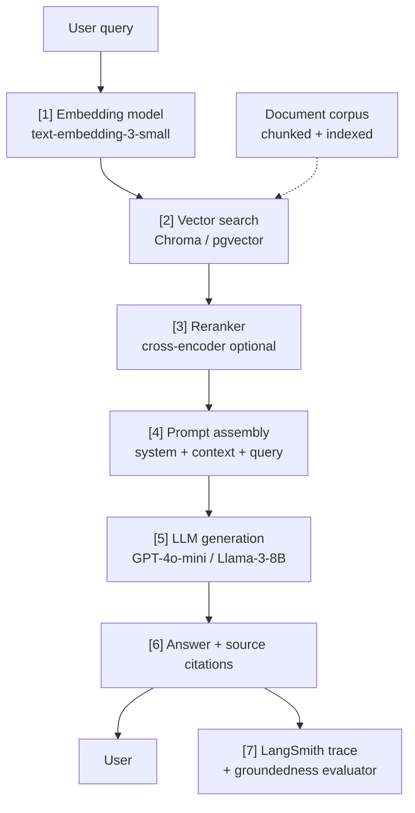

# RAG Question-Answering System

## Purpose

End-to-end implementation of a retrieval-augmented generation (RAG) question-answering system over a private document corpus. This system ingests documents, chunks and embeds them into a vector store, retrieves relevant passages at query time, and passes them as context to an LLM to generate grounded answers. Key challenges: chunking strategy, retrieval quality (recall vs. precision), answer groundedness, and latency. Spans `05_ai_engineering` (RAG architecture, vector stores, serving) and `03_software_engineering` (API design, Docker).

### Examples

- Internal knowledge base Q&A over company policies and documentation
- Customer support assistant grounded in product documentation
- Research assistant over a corpus of scientific papers

## Architecture



**Component stack:**
- Embedding: `text-embedding-3-small` (OpenAI) or `all-mpnet-base-v2` (local)
- Vector store: Chroma (dev) → pgvector / Qdrant (production)
- Reranker: `cross-encoder/ms-marco-MiniLM-L-6-v2` (optional, +quality)
- LLM: GPT-4o-mini (cloud) or Llama-3-8B via vLLM (self-hosted)
- Serving: FastAPI
- Observability: LangSmith

## Implementation Notes

**Step 1 — Document ingestion and chunking:**
```python
from langchain.text_splitter import RecursiveCharacterTextSplitter
from langchain_community.document_loaders import DirectoryLoader, UnstructuredPDFLoader

loader = DirectoryLoader("./docs/", glob="**/*.pdf", loader_cls=UnstructuredPDFLoader)
raw_docs = loader.load()

splitter = RecursiveCharacterTextSplitter(
    chunk_size=512,
    chunk_overlap=64,
    separators=["\n\n", "\n", ". ", " "]
)
chunks = splitter.split_documents(raw_docs)
print(f"Created {len(chunks)} chunks from {len(raw_docs)} documents")
```

**Step 2 — Index into Chroma:**
```python
import chromadb
from langchain_chroma import Chroma
from langchain_openai import OpenAIEmbeddings

client = chromadb.PersistentClient(path="./chroma_db")
embeddings = OpenAIEmbeddings(model="text-embedding-3-small")

vectorstore = Chroma.from_documents(
    documents=chunks,
    embedding=embeddings,
    client=client,
    collection_name="docs"
)
```

**Step 3 — Retrieval with optional reranking:**
```python
from sentence_transformers import CrossEncoder

reranker = CrossEncoder("cross-encoder/ms-marco-MiniLM-L-6-v2")

def retrieve(query: str, k: int = 3) -> list[str]:
    # Dense retrieval — top-20 candidates
    candidates = vectorstore.similarity_search(query, k=20)
    
    # Cross-encoder reranking — pick top-3
    pairs  = [(query, c.page_content) for c in candidates]
    scores = reranker.predict(pairs)
    ranked = sorted(zip(scores, candidates), key=lambda x: x[0], reverse=True)
    
    return [doc.page_content for _, doc in ranked[:k]]
```

**Step 4 — Prompt assembly and LLM call:**
```python
SYSTEM_PROMPT = """You are a helpful assistant. Answer the question using ONLY the provided context.
If the answer is not in the context, say "I don't have enough information to answer this."
Always cite the source passage(s) you used."""

def answer(question: str) -> dict:
    context_docs = retrieve(question, k=3)
    context      = "\n\n---\n\n".join(
        f"[{i+1}] {doc}" for i, doc in enumerate(context_docs)
    )
    
    response = openai_client.chat.completions.create(
        model="gpt-4o-mini",
        messages=[
            {"role": "system",  "content": SYSTEM_PROMPT},
            {"role": "user",    "content": f"Context:\n{context}\n\nQuestion: {question}"}
        ],
        temperature=0.1,    # low temperature for factual Q&A
        max_tokens=512,
    )
    return {
        "answer":  response.choices[0].message.content,
        "sources": context_docs
    }
```

**Step 5 — FastAPI service:**
```python
from fastapi import FastAPI
from pydantic import BaseModel

app = FastAPI()

class Query(BaseModel):
    question: str

class Answer(BaseModel):
    answer:  str
    sources: list[str]

@app.post("/ask", response_model=Answer)
async def ask(query: Query) -> Answer:
    result = answer(query.question)
    return Answer(**result)
```

**Step 6 — Groundedness evaluation (async, via LangSmith):**
```python
from langsmith import traceable

@traceable(name="rag-qa")
def answer_traced(question: str) -> dict:
    return answer(question)

# Offline evaluation:
# from langsmith.evaluation import evaluate, LangChainStringEvaluator
# evaluate(lambda x: answer_traced(x["question"])["answer"],
#          data="rag-regression-v1",
#          evaluators=[LangChainStringEvaluator("groundedness")])
```

**Key design trade-offs:**

| Decision | Option A | Option B |
|---|---|---|
| Chunk size | 256 tokens (precise) | 1024 tokens (context-rich) |
| Retrieval | Dense only (fast) | Dense + reranking (+30% quality) |
| LLM | GPT-4o-mini ($) | Llama-3-8B via vLLM (self-hosted) |
| Vector store | Chroma (dev) | pgvector / Qdrant (production scale) |

**Failure modes to monitor:**
- Retrieval miss: relevant document not returned → increase k or improve chunking
- Hallucination despite context: LLM ignores context → strengthen system prompt
- Context overflow: many long passages → budget context explicitly
- Latency spike: reranker adds 200 ms → profile and cache common queries

## Links
- [[rag_architecture|RAG Architecture]]
- [[vector_stores|Vector Stores]]
- [[chroma_vector_store|Chroma Vector Store]]
- [[llm_observability|LLM Observability]]
- [[langsmith_llm_observability|LangSmith LLM Observability]]
- [[serving_frameworks|LLM Serving Frameworks]]
- [[vllm_serving|vLLM Serving]]
- [[model_serving_with_fastapi|Model Serving with FastAPI]]
